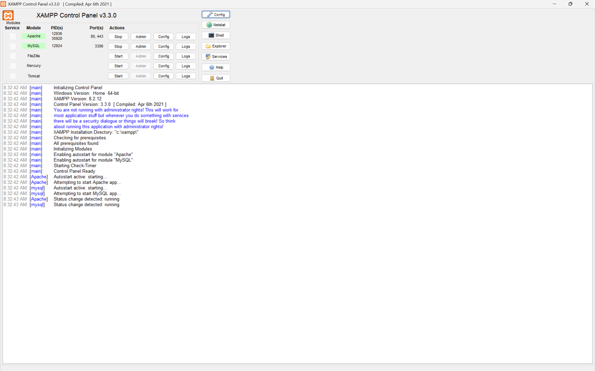
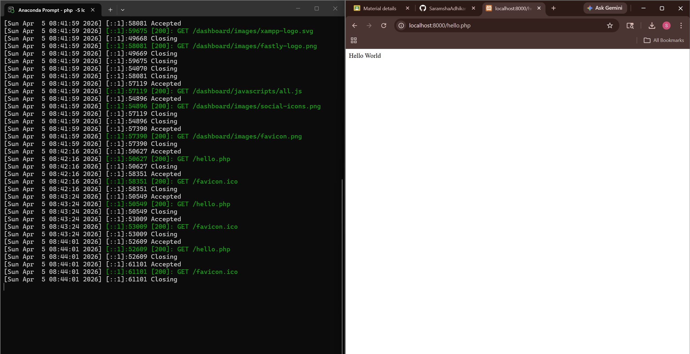
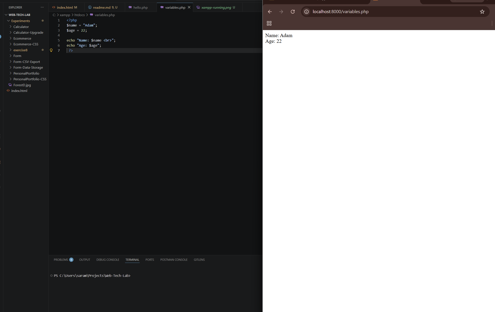
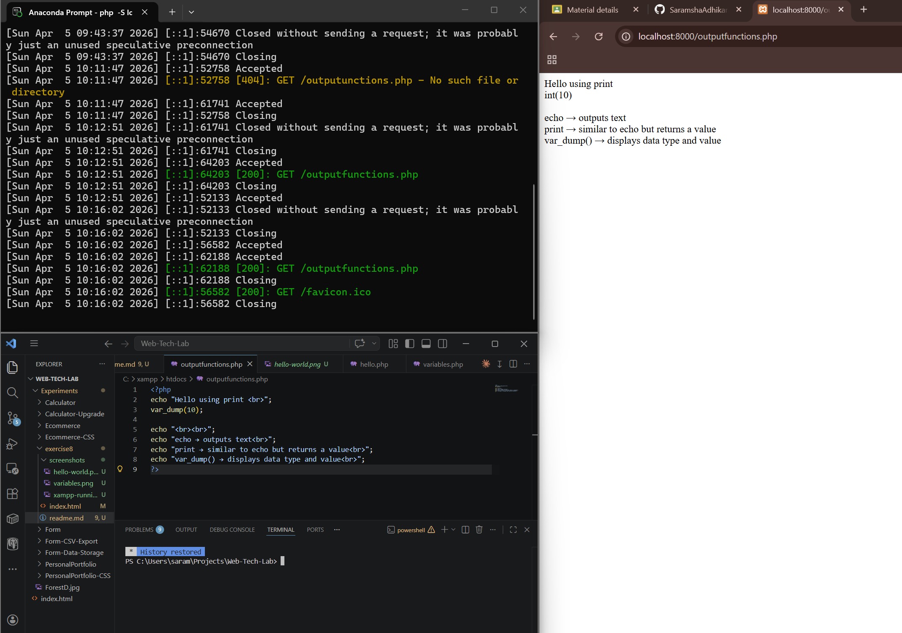
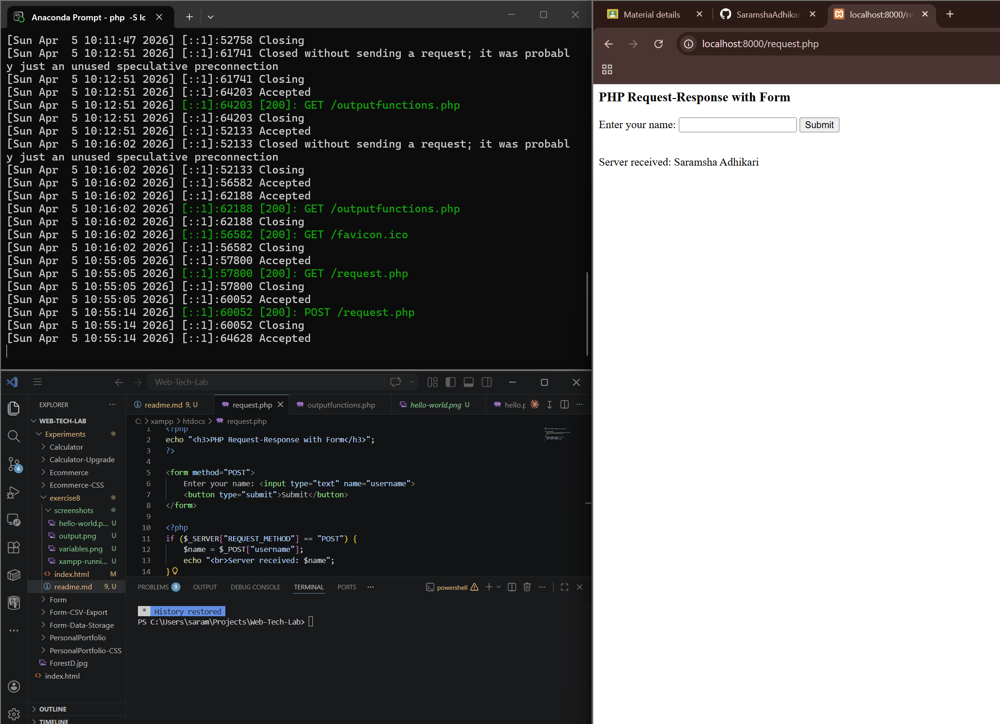

# Experiment 8: Introduction to PHP

## Objective

To install PHP using XAMPP and understand basic PHP concepts such as variables, output functions and executing through a local server.

---

## Step 1: What is PHP?

PHP (Hypertext Preprocessor) is a server-side scripting language used to create dynamic web pages. Unlike JavaScript, which runs in the browser, PHP runs on the server and sends the output to the browser.

---

## Step 2: Installing XAMPP.

* Downloaded and installed XAMPP.
* Opened XAMPP Control Panel.
* Started the **Apache** server.

### Screenshot



---

## Step 3: Running First PHP Program.

Created a file named `hello.php` inside the XAMPP `htdocs` folder.

### Code

```php
<?php
echo "Hello World";
?>
```

Accessed in browser using:

```
http://localhost/hello.php
```

### Screenshot



---

## Step 4: Using Variables in PHP.

### Code

```php
<?php
$name = "John";
$age = 20;

echo "Name: $name <br>";
echo "Age: $age";
?>
```

### Screenshot



---

## Step 5: Output Functions.

### Code

```php
<?php
print "Hello using print <br>";
var_dump(10);
?>
```

### Explanation

* `echo` → outputs text
* `print` → similar to echo but returns a value
* `var_dump()` → displays data type and value

### Screenshot



---

## Step 6: PHP Request-Response Cycle.

When a PHP file is accessed:

1. Browser sends a request to the server.
2. Server executes the PHP code.
3. Output is sent back to the browser.

Example URL:

```
http://localhost/request.php
```

### Screenshot



---

## Conclusion

* Successfully installed and ran PHP using XAMPP.
* Learned basic PHP syntax and execution.
* Understood variables and output functions.
* Verified execution using localhost.

---
